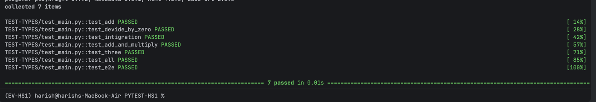
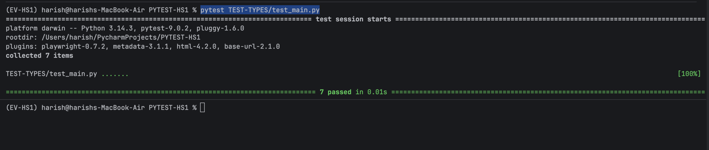
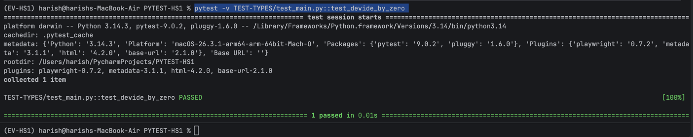

# Verbose mode

## 1.pytest -v

# 

## 2.pytest filepath from root
### EX: pytest TEST-TYPES/test_main.py

# 

## 3. To run specific file 
### pytest -v TEST-TYPES/test_main.py::test_devide_by_zero 

# 

# continued :: Day-2 
